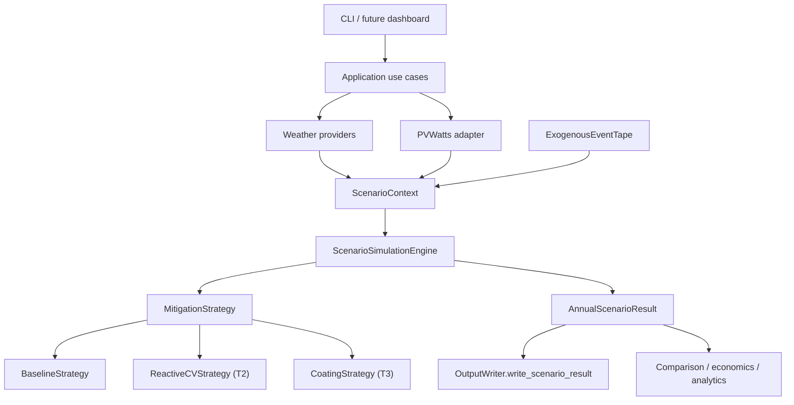

# T1 Shared Interface Architecture

T1 freezes the scenario seam without adding Phase 4 behavior.

## Core Rule

`ScenarioSimulationEngine` owns the annual daily loop. Strategies own only initial state and per-day decisions. The engine contains no scenario-name conditionals.

## Existing Baseline Compatibility

`BaselineSimulationEngine` remains the public Phase 1-3.5 API. It now delegates to `BaselineStrategy` and `ScenarioSimulationEngine`, then converts the generic result back into `BaselineSimulationResult`.

## Configuration Boundaries

- Weather configuration stays owned by `weather`.
- PV capacity and orientation stay owned by `pv_system`.
- Panel/cohort structure stays owned by `farm`.
- Baseline contamination assumptions stay owned by `soiling`, `rainfall_cleaning`, and `bird_droppings`.
- T2 reactive CV must add its own configuration section later.
- T3 coating/economics must add their own configuration sections later.
- T4 analytics/dashboard must consume scenario results, not mutate simulation inputs.

## Persistence Boundary

Generic scenario output is written through `OutputWriter.write_scenario_result()`:

- `scenario_daily_results.csv`
- `scenario_events.csv`
- `scenario_summary.json`

Legacy baseline outputs remain available for backward-compatible CLI behavior.

