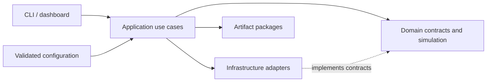
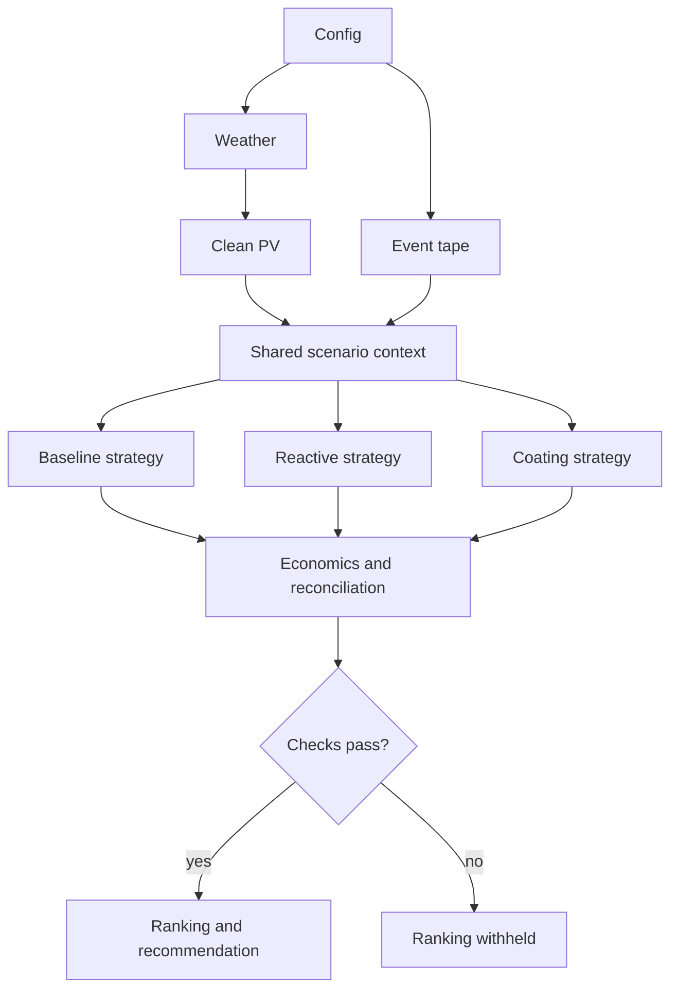

# Architecture

SolarClean-DT is a modular monolith. Domain rules are isolated from external data, persistence, and
user interfaces.

## Layers

| Layer | Owns | Must not own |
| --- | --- | --- |
| Domain | Weather/PV contracts, contamination, farm state, event tape, strategies, economics contracts | HTTP, files, plotting, CLI, dashboard, pvlib objects |
| Application | Use-case orchestration, comparisons, validation, robustness studies | Provider-specific parsing or UI logic |
| Infrastructure | NASA POWER, CSV and fixture providers, pvlib adapter, files, reports, plots | Scenario policy |
| Configuration | YAML loading and strict boundary validation | Simulation state |
| CLI/dashboard | Input collection and presentation | Physics, economics, or ranking formulas |

Dependencies point inward toward domain contracts. Replacing a weather provider or presentation
layer does not require a change to simulation rules.

## Comparison path

One comparison resolves configuration, weather, clean PV, and the event tape once. The application
then runs three strategies through the same engine, aggregates economics, reconciles shared inputs
and totals, and finally writes a ranking if the calculations reconcile.

See [scenario comparability](scenario-comparability.md) for fairness guarantees and
[ADR-0001](../adr/0001-modular-monolith.md) for the architectural decision.
