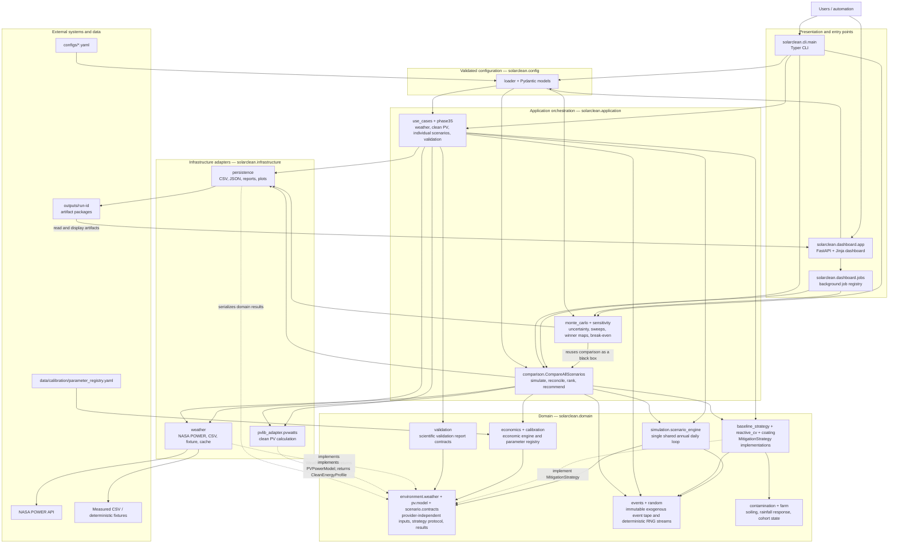

# High-Level Architecture Diagram

This is the primary map of SolarClean-DT. Solid arrows show runtime calls or data movement;
dashed arrows show adapter-to-contract relationships.

The domain owns simulation rules and contracts. Network access, pvlib objects, plotting, and
filesystem writes remain in infrastructure; the CLI and dashboard invoke application use cases.
