# Module Dependency Diagram

An arrow from `A` to `B` means that `A` imports or otherwise depends on `B`. When a node groups
several tightly related modules, an arrow means that at least one module listed in the source node
creates that dependency. Standard-library and third-party imports are omitted.

```mermaid
flowchart TB
    subgraph INTERFACES["Interfaces"]
        CLI["solarclean.cli.main"]
        DASH_RUN["solarclean.dashboard.__main__"]
        DASH["solarclean.dashboard.app"]
        DASH_SUPPORT["solarclean.dashboard.artifacts<br/>solarclean.dashboard.jobs"]
    end

    subgraph APPLICATION["Application"]
        UC["solarclean.application.use_cases"]
        CMP["solarclean.application.comparison"]
        P35["solarclean.application.phase35"]
        MC["solarclean.application.monte_carlo"]
        SENS["solarclean.application.sensitivity"]
    end

    subgraph CONFIGURATION["Configuration"]
        CFG_LOAD["solarclean.config.loader"]
        CFG["solarclean.config.models"]
    end

    subgraph INFRASTRUCTURE["Infrastructure"]
        WEATHER_PROVIDERS["solarclean.infrastructure.weather<br/>nasa_power · csv_provider · fixture"]
        WEATHER_CACHE["solarclean.infrastructure.weather.cache"]
        PVLIB["solarclean.infrastructure.pvlib_adapter.pvwatts"]
        PERSIST["solarclean.infrastructure.persistence<br/>outputs · plots · reports"]
    end

    subgraph DOMAIN["Domain"]
        ENV["solarclean.domain.environment.weather"]
        RNG["solarclean.domain.random.streams"]
        EVENTS["solarclean.domain.events.tape"]
        SOIL["solarclean.domain.contamination.soiling"]
        FARM["solarclean.domain.farm.representation"]
        PV["solarclean.domain.pv.model"]
        SCENARIO["solarclean.domain.scenario.contracts"]
        SIM["solarclean.domain.simulation<br/>scenario_engine · baseline_strategy · baseline"]
        COATING["solarclean.domain.coating<br/>costs · physics · state · strategy"]
        REACTIVE["solarclean.domain.reactive_cv<br/>strategy · state · scheduler · observer<br/>metrics · drone · dispatch · crew"]
        ECON["solarclean.domain.economics<br/>contracts · adapters · engine · integration<br/>calibration · reconciliation · registry · summary"]
        CAL["solarclean.domain.calibration<br/>registry · parameter_overrides"]
        VALID["solarclean.domain.validation.reports"]
    end

    DASH_RUN -.->|"dynamic Uvicorn target"| DASH
    DASH --> DASH_SUPPORT
    DASH --> CMP
    DASH --> MC
    DASH --> SENS
    DASH --> CFG_LOAD
    DASH --> CAL

    CLI --> UC
    CLI --> CMP
    CLI --> P35
    CLI --> MC
    CLI --> SENS
    CLI --> CFG_LOAD
    CLI --> PERSIST

    CFG_LOAD --> CFG

    CMP --> UC
    P35 --> UC
    MC --> CMP
    SENS --> CMP

    UC --> CFG
    UC --> WEATHER_PROVIDERS
    UC --> PVLIB
    UC --> PERSIST
    UC --> COATING
    UC --> REACTIVE
    UC --> SIM
    UC --> SCENARIO
    UC --> EVENTS
    UC --> ENV
    UC --> FARM
    UC --> SOIL

    CMP --> CFG
    CMP --> PVLIB
    CMP --> PERSIST
    CMP --> CAL
    CMP --> COATING
    CMP --> REACTIVE
    CMP --> ECON
    CMP --> SIM
    CMP --> SCENARIO
    CMP --> EVENTS
    CMP --> ENV
    CMP --> FARM
    CMP --> PV
    CMP --> SOIL

    P35 --> CFG
    P35 --> PVLIB
    P35 --> PERSIST
    P35 --> VALID
    P35 --> SIM
    P35 --> EVENTS
    P35 --> ENV
    P35 --> FARM
    P35 --> PV
    P35 --> SOIL

    MC --> CFG
    MC --> PVLIB
    MC --> PERSIST
    MC --> CAL
    MC --> ENV
    MC --> PV

    SENS --> CFG
    SENS --> PVLIB
    SENS --> PERSIST
    SENS --> CAL
    SENS --> ENV
    SENS --> PV

    WEATHER_PROVIDERS --> WEATHER_CACHE
    WEATHER_PROVIDERS --> ENV
    WEATHER_CACHE --> ENV
    PVLIB --> CFG
    PVLIB --> ENV
    PVLIB --> PV
    PERSIST --> CFG
    PERSIST --> ENV
    PERSIST --> PV
    PERSIST --> SCENARIO
    PERSIST --> SIM

    EVENTS --> CFG
    EVENTS --> RNG
    SOIL --> CFG
    SOIL --> EVENTS
    FARM --> CFG
    FARM --> SOIL
    PV --> CFG
    PV --> ENV
    SCENARIO --> CFG
    SCENARIO --> SOIL
    SCENARIO --> ENV
    SCENARIO --> EVENTS
    SCENARIO --> PV
    SIM --> CFG
    SIM --> SOIL
    SIM --> ENV
    SIM --> EVENTS
    SIM --> FARM
    SIM --> PV
    SIM --> SCENARIO
    COATING --> CFG
    COATING --> SOIL
    COATING --> FARM
    COATING --> SCENARIO
    REACTIVE --> CFG
    REACTIVE --> SOIL
    REACTIVE --> FARM
    REACTIVE --> SCENARIO
    ECON --> CAL
    ECON --> SCENARIO
    CAL --> CFG
    CAL --> ECON
```

The aggregate `CAL` ↔ `ECON` relationship is asymmetric at module level:
`calibration.parameter_overrides` imports `economics`, while `economics.calibration` imports
`calibration.registry`; there is no direct two-module circular import. Re-export-only
`__init__.py` edges are omitted for readability.
