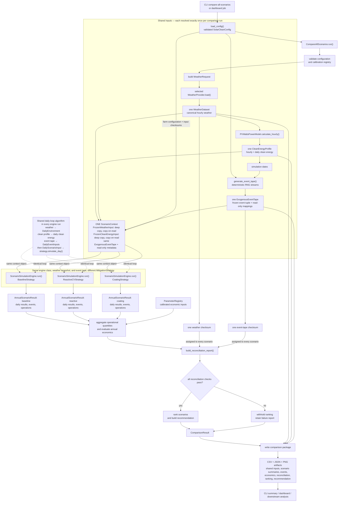

# Simulation Data-Flow Diagram

This diagram follows the canonical `compare-all-scenarios` run. The central fan-out is deliberate:
baseline, reactive, and coating all receive the same copy-protected weather snapshot and the same
immutable environmental event tape.

Scenario strategies consume `DailyEventInputs`; they do not generate or mutate the shared event
tape. Scenario-local random draws may support intervention behavior, but they do not replace or
regenerate the exogenous conditions used for comparison.
