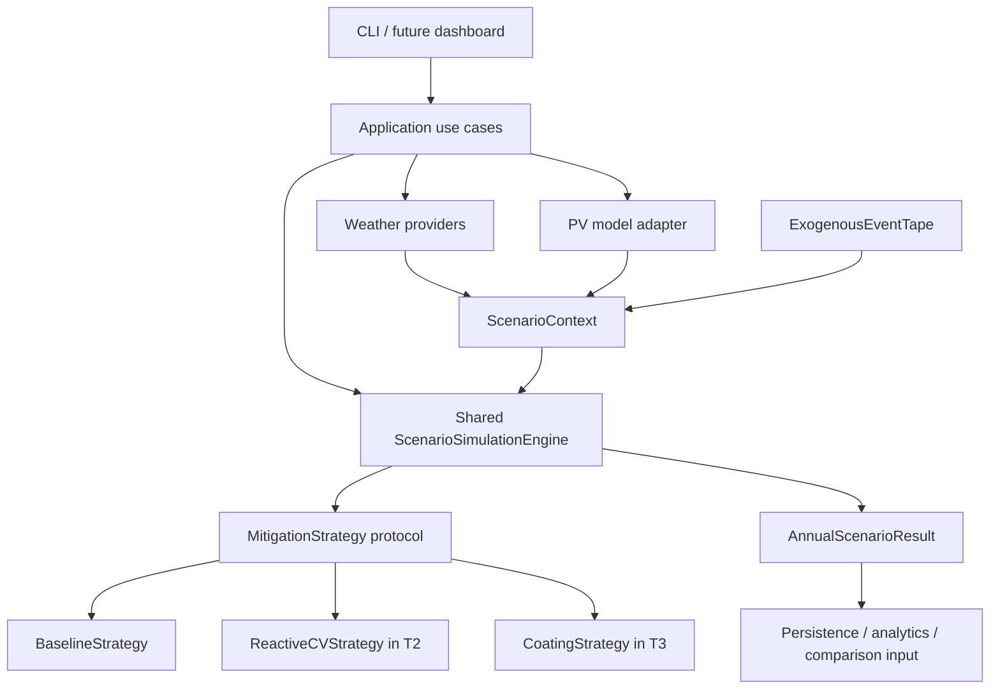

# SolarClean-DT T1 Contract Freeze Design

## Purpose

T1 freezes the shared interfaces needed by parallel developers working on reactive CV, coating, economics, analytics, and dashboard modules. It does not add any Phase 4 scenario behavior. The goal is to make future strategies pluggable through one shared daily simulation loop, while preserving the Phase 1-3.5 baseline behavior and output compatibility.

## Current Audit Summary

Already present:

- Provider-independent weather contracts: `WeatherRequest`, `WeatherDataset`, and `WeatherProvider`.
- Clean PV result contract: `CleanEnergyProfile`.
- Farm contracts and states: `FarmRepresentation`, `RepresentativePanelFarm`, `CohortFarm`, `FarmState`, and `CohortState`.
- Immutable, serializable exogenous event tape: `ExogenousEventTape`, `ExogenousEvent`, and `DailyEventInputs`.
- Baseline no-intervention annual loop and output writer.
- Validation reports, calibration presets, and Phase 3.5 full-year reporting.

Missing before T1:

- A generic scenario input/context shared by all mitigation strategies.
- A mitigation strategy protocol.
- Shared daily and annual scenario result models.
- Shared operational quantities for inspections, cleaning, coating, cost, and metadata placeholders without implementing those behaviors.
- A common domain-event structure owned by the scenario contract layer.
- A scenario-specific extension mechanism that does not break common result handling.
- A comparison-engine input contract.
- A persistence contract for generic scenario results.
- Contract tests proving future strategies can be substituted without duplicating annual loops or adding scenario-name conditionals.

## Design Decision

Add a thin contract layer under `solarclean.domain.scenario` and a generic daily loop under `solarclean.domain.simulation.scenario_engine`.

The new engine owns the annual/day iteration once. A strategy owns only day-level intervention logic and returns a `DailyScenarioResult`. This keeps future `BaselineStrategy`, `ReactiveCVStrategy`, and `CoatingStrategy` on the same path. Existing `BaselineSimulationEngine` remains as a compatibility facade returning `BaselineSimulationResult`; internally it delegates to `BaselineStrategy` and the shared scenario engine.

## Frozen Contracts

### Scenario Context

`ScenarioContext`

- `weather`: `WeatherDataset`, canonical hourly weather input, read-only by convention.
- `clean_energy`: `CleanEnergyProfile`, hourly and daily clean PV input, read-only by convention.
- `event_tape`: `ExogenousEventTape | None`, immutable exogenous stochastic inputs.
- `farm_config`: `FarmConfig | None`, farm ownership boundary for panel/cohort structure.
- `metadata`: immutable mapping for run identifiers, source checksums, or experiment tags.

### Daily Scenario Input

`DailyScenarioInput`

- `date`: `datetime.date`.
- `clean_energy_kwh`: float, whole-farm clean AC energy for the day.
- `clean_energy_per_panel_kwh`: float, per-panel clean AC energy for the day.
- `environment`: `DailyEnvironment`.
- `event_inputs`: `DailyEventInputs | None`.
- `day_index`: zero-based integer.

### Mitigation Strategy

`MitigationStrategy` protocol

- `name: str`.
- `initial_state(context, rng) -> object`.
- `simulate_day(day_input, state, context, rng) -> StrategyStep`.

`StrategyStep`

- `state`: next strategy state.
- `result`: `DailyScenarioResult`.

Strategies may use their own internal dataclass state. The engine treats state as opaque.

### Daily Scenario Result

`DailyScenarioResult`

- `date`: `datetime.date`.
- `scenario_name`: string.
- `clean_energy_kwh`: float.
- `actual_energy_kwh`: float.
- `energy_loss_kwh`: float.
- `soiling_ratio`: float.
- `operational`: `OperationalQuantities`.
- `events`: tuple of `DomainEvent`.
- `extensions`: immutable mapping for scenario-specific scalar or structured values.

Common handling must ignore unknown extension keys while preserving them in JSON/CSV output where practical.

### Annual Scenario Result

`AnnualScenarioResult`

- `scenario_name`: string.
- `daily_results`: tuple of `DailyScenarioResult`.
- `events`: tuple of `DomainEvent`.
- `annual_clean_energy_kwh`: float.
- `annual_actual_energy_kwh`: float.
- `annual_energy_loss_kwh`: float.
- `annual_energy_loss_percent`: float.
- `extensions`: immutable mapping for scenario-specific annual values.
- `to_daily_frame()`: common tabular daily output.
- `summary()`: common JSON-safe summary.

### Operational Quantities

`OperationalQuantities`

- `inspections_count`: integer.
- `cleaning_actions_count`: integer.
- `coated_panel_count`: integer.
- `crew_hours`: float, hours.
- `drone_flight_hours`: float, hours.
- `water_liters`: float, liters.
- `energy_used_kwh`: float, kWh.
- `opex_cost`: float, configured currency units.
- `capex_cost`: float, configured currency units.

Baseline uses zeros. Future modules can fill these without changing common result aggregation.

### Domain Events

`DomainEvent`

- `date`: `datetime.date`.
- `event_type`: string.
- `magnitude`: float.
- `description`: string.
- `scenario_name`: string.
- `cohort_id`: integer or `None`.
- `metadata`: immutable mapping.

The legacy `SimulationEvent` remains for baseline compatibility. T1 adds conversion helpers rather than rewriting existing event producers.

### Comparison Input

`ScenarioComparisonInput`

- `context`: `ScenarioContext`.
- `strategies`: tuple of `MitigationStrategy`.
- `random_seed`: integer.
- `metadata`: immutable mapping.

This contract is for T2/T3/T4 comparison engines. T1 does not implement economics, sensitivity analysis, or dashboards.

### Persistence Contract

`ScenarioOutputBundle`

- `summary`: JSON-safe mapping.
- `daily_frame`: common daily table.
- `events`: tuple of `DomainEvent`.
- `extensions`: immutable mapping.

`OutputWriter.write_scenario_result()` writes common scenario result artifacts while preserving unknown extension keys. Existing baseline writer remains available for backwards compatibility.

## Module Boundary Diagram

## Non-Goals

T1 does not implement reactive CV, drone routing, manual cleaning dispatch, coating physics, economics, sensitivity analysis, dashboard behavior, databases, APIs, or optimization.

## Acceptance Evidence

- Contract tests instantiate a mock future strategy and run it through `ScenarioSimulationEngine`.
- Contract tests prove immutable event tape, daily inputs, extension maps, and context metadata reject mutation.
- Tests prove unknown scenario-specific extension fields survive common summary/frame handling.
- Baseline regression tests still pass with unchanged fixture values.
- Ruff, mypy, and full pytest pass.
- `PLAN.md`, `PROGRESS.md`, data-contract docs, architecture docs, integration checklist, branch/module ownership guidance, and ADR-009 record the frozen contracts.
